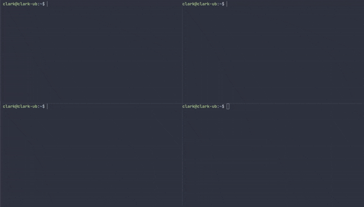

# comms-cli

[](https://github.com/daniel-c-ward/comms-cli/actions)
[](https://opensource.org/licenses/MIT)
[](https://github.com/daniel-c-ward/comms-cli/releases)

A CLI tool for managing the comms hub and pi agents.

## Demo



`comms status` shows hub health and live agent cards — name, model, context use and queue depth.

## Installation

### Prerequisites
- Go 1.26 or later
- pi agent installed (https://https://pi.dev/)

### Install comms-cli

```bash
go install github.com/daniel-c-ward/comms-cli/cmd/comms@latest
comms setup
```

`comms setup` installs the comms extension into pi's auto-discovery directory and smoke-verifies it loads.

Prefer a development checkout?

```bash
git clone https://github.com/daniel-c-ward/comms-cli
cd comms-cli
go install ./cmd/comms
```

## Setup

After installation, run the setup command to install the comms extension:

```bash
comms setup
```

This will:
1. Locate the pi executable on your PATH
2. Install the comms extension into pi's auto-discovery directory
3. Smoke-verify that the extension loads correctly

## Usage

### Hub Commands
- `comms serve` - Run the hub in the foreground
- `comms start` - Spawn a detached hub
- `comms status` - Show hub health and agent cards
- `comms stop` - Stop a detached hub
- `comms join <name>` - Spawn a pi agent in the foreground

Run `comms <command> -h` for command-specific flags.

## Status

**v0.1.0** — pre-1.0: expect breaking changes between releases.

- Linux is the primary tested platform; macOS and Windows are built in CI but not runtime-tested.
- Known issue: prompts can be silently dropped when a slow consumer's stream fills, while still being marked delivered ([#11](https://github.com/daniel-c-ward/comms-cli/issues/11)) — p0 on the roadmap.
- Local-first hub: loopback by default; multi-machine and TLS support are on the roadmap.

## Development

Want to help? Issues labelled [good first issue](https://github.com/daniel-c-ward/comms-cli/labels/good%20first%20issue) are small and self-contained — pick one and a maintainer will review it promptly. See [CONTRIBUTING.md](CONTRIBUTING.md) for coding conventions and setup instructions.

## License

This project is licensed under the MIT License - see the [LICENSE](LICENSE) file for details.
